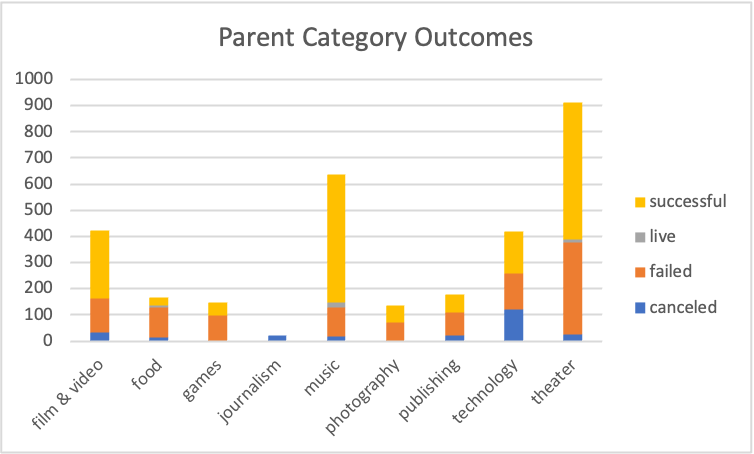
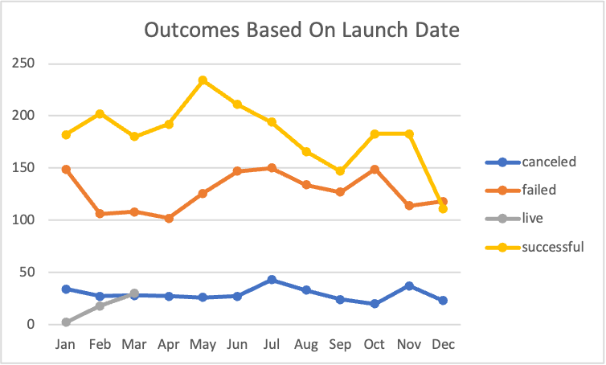
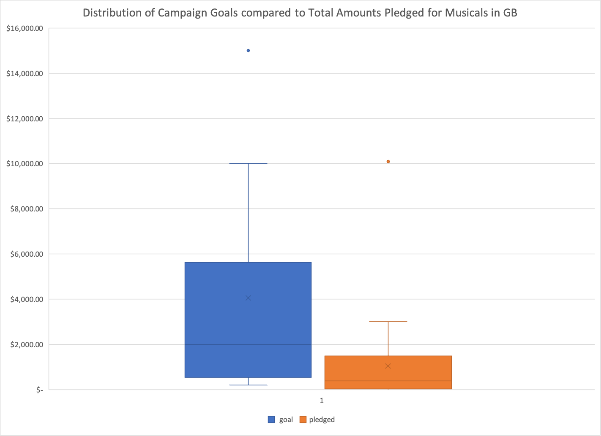

# An Analysis of Kickstarter Campaigns
Performed analysis on kickstarter data with a sample size of 4114 campaigns to reveal trends for Louise, an upcoming playwright, who wants to fund her up-incoming play with a budget of 10k. Out of all the kickstarter campaigns in the dataset, theater campaigns are the most popular and  approximately 64% of these campaigns were successful. The ways in which theater compares to other categories of kickstarter campaigns can be visually seen in the graph below.

 

**This graph shows different categories of kickstarter campaigns on the x axis with different counts of outcomes on the y axis.**

There is a correlation between the time of year these campaigns are launched. May and June both have the greatest success rate for all kickstarter campaigns as seen through the way the success line in the line graph below spikes during these months.

 

**This graph shows the month in which the campaign was launched on the x axis and the counts of outcomes on the y axis**

On average successfull kickstarter campaigns have a goal of $5,049. Louise is most interested in the Great Britain market and while there are only a total of 604 Kickstarter campaigns in Great Britain, the "theater" category is the most successful. About 70% of successful kickstarter campaigns are theater ones, and 72% of these theater campaigns succeed. When comparing the distribution of campaign goals to the distribution of total amounts pledged for musicals specifically in Great Britain, the average campaign goal is around £4,000. Louise should try to get her play produced for less than £4,000 since this is outside of the range of outliers for amounts pledged as shown in the boxplot below. It is also worth noting that half of the campaign goals are less than £2,000, which is just over the 3rd quartile/75% of the amounts pledged, so Louise should therefore keep this in mind when deciding on her campaign goal. 

Overall, theater is a good category to crowdfund for, especially in Great Britain. However, Louise may want to adjust her goal to align more with the findings presented above and be conscious of the month in which it is launched if she wants to increase the chances of it being successfull.
